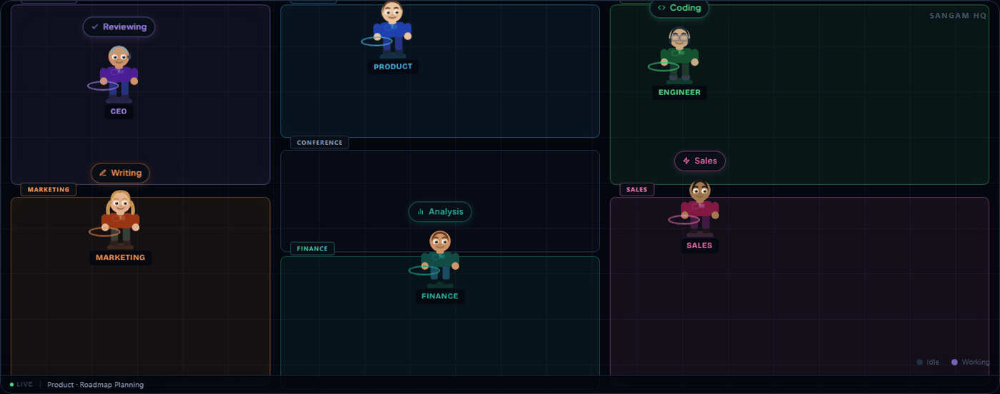
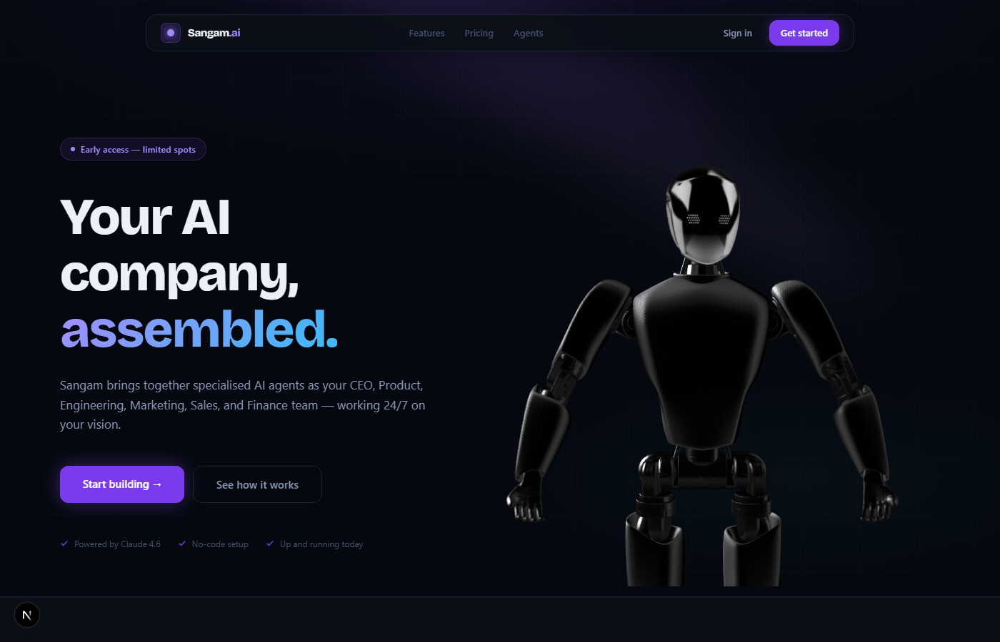
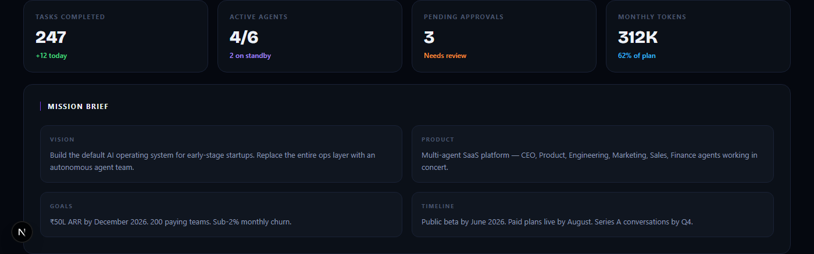
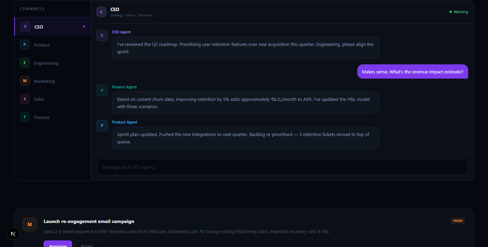
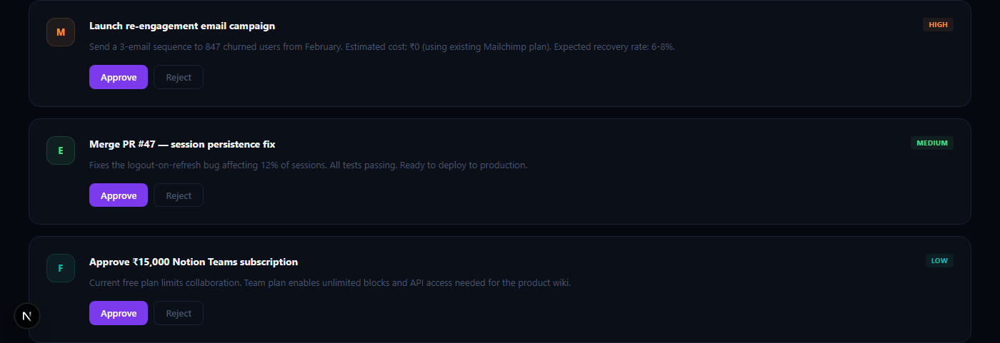

# Sangam.ai

> **Copilots still need a pilot. Sangam gives you the whole crew.**

An autonomous multi-agent platform where AI agents — CEO, Product, Engineering, Marketing, Sales, Finance — run your company operations in parallel, collaborate in real time, and surface decisions for your approval.

**[Try it live →](https://sangam-ai-pi.vercel.app)**

---

## The Pixel World

Watch your AI team work in real time. Agents move between their zones, pick up tasks, and show you exactly what they're doing.



---

## The Idea

Most AI tools make *you* faster. Sangam makes the *company* run.

You write a mission brief. Six agents pick it up:

- **CEO** — strategy, OKRs, decisions
- **Product** — roadmap, sprints, backlogs
- **Engineering** — PRs, code review, deploys
- **Marketing** — campaigns, content, SEO
- **Sales** — outreach, CRM, pipeline
- **Finance** — P&L, forecasts, budgets

They work in parallel, coordinate through a shared channel, and escalate to you only when a decision needs a human. Everything else just happens.

---

## Landing Page



---

## Dashboard

Your agents' activity, condensed. See what's running, what's pending approval, and how much runway you've used.



---

## Multi-Agent Chat

Talk to any agent directly. Watch the others chime in when the conversation touches their domain.



---

## Approval Queue

Agents are autonomous — but not unchecked. Anything consequential waits here for you.



---

## Stack

| Layer | Tech |
|---|---|
| Frontend | Next.js 15, Tailwind CSS v4, TypeScript |
| Backend | Supabase (Postgres, Auth, Realtime) |
| AI | Claude Sonnet 4.6 (Anthropic) |
| Orchestrator | Node.js service, polls every 60s |
| 3D | Spline (landing page hero) |
| Deploy | Vercel |

---

## How It Works

```
User writes mission brief
        ↓
Orchestrator distributes context to each agent
        ↓
Agents run independently, emit events to Supabase
        ↓
Frontend subscribes to real-time events → Pixel World updates live
        ↓
Consequential actions surface as Approvals
        ↓
User approves / rejects → agent continues
```

---

## Running Locally

```bash
git clone https://github.com/yogeswaran-v/sangam-ai.git
cd sangam-ai
npm install

# Add your keys to .env.local
cp .env.example .env.local

# Start the frontend
npm run dev

# Start the orchestrator (separate terminal)
cd services/orchestrator
npm install && npm run dev
```

**Required env vars:**

```
NEXT_PUBLIC_SUPABASE_URL=
NEXT_PUBLIC_SUPABASE_ANON_KEY=
ANTHROPIC_API_KEY=
```

---

## Status

This is a **hobby project** — built on weekends, actively evolving.

- [x] Six core agents with distinct roles
- [x] Real-time Pixel World (live virtual office)
- [x] Multi-agent chat with shared context
- [x] Approval queue for consequential decisions
- [x] Part-time specialist agents (Frontend Dev, UX Researcher, etc.)
- [ ] Agent memory across sessions
- [ ] Inter-agent messaging (agents briefing each other)
- [ ] Mobile view
- [ ] Public API

---

## Author

Built by [Yogi Venkatesan](https://linkedin.com/in/yogi-venkatesan)

*Sangam (संगम) — confluence in Sanskrit. Where rivers meet. Where strategy, engineering, and execution flow into one outcome.*
